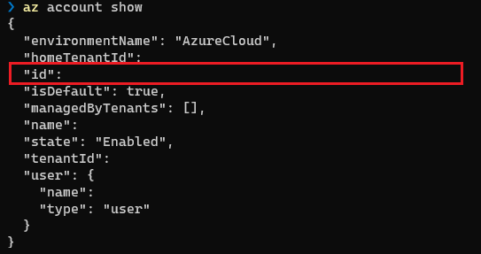
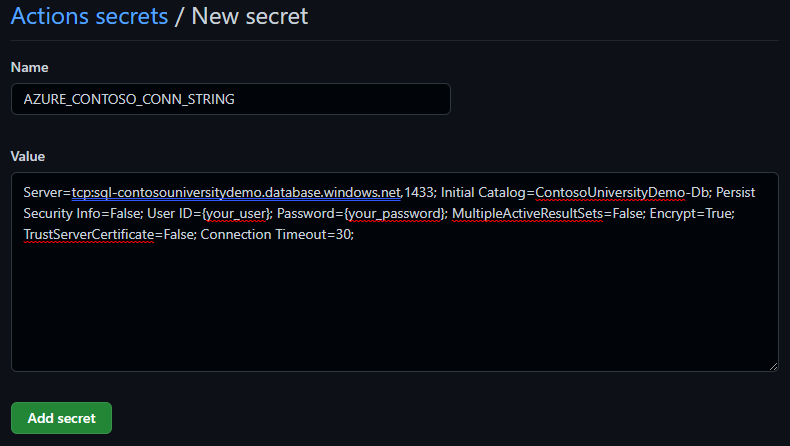
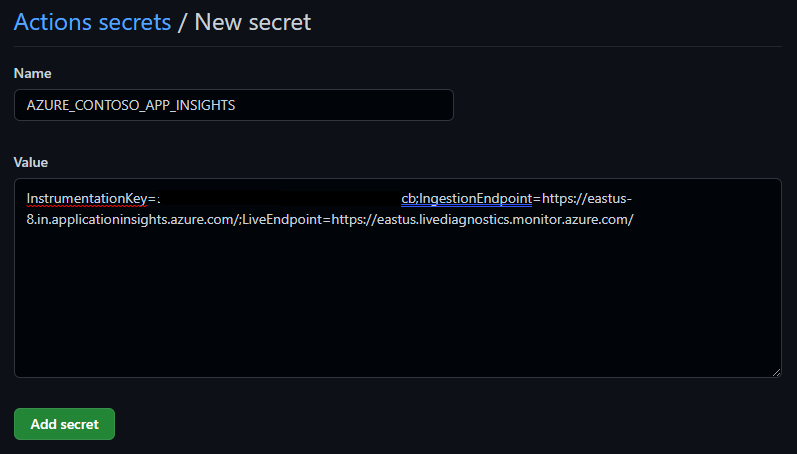

# Emergent Software .NET MVC Web app, Azure SQL, Bicep, and Github Actions
## Introduction

Contoso University is a sample application that demonstrates how to use Entity Framework Core in an ASP.NET Core Razor Pages web app. This app can be deployed to Microsoft's Azure cloud platform that allows you to build, deploy, and scale web apps.

[](https://github.com/codespaces/new?hide_repo_select=true&ref=main&repo=518921454)

## Tech stack:

- Azure
- Azure-sql-db
- .NET MVC Web
- Github Actions
- App Insights
- Log Analytics
- Bicep
- Azure Key Vault
- Azure Load Testing

## Application Architecture
This application utilizes the following Azure resources:

- Azure App Services to host the Web frontend and API backend
- Azure SQL DB for storage
- Azure App Insights for monitoring 
- Log Analystics for logging
- Load Testing to generate high-scale load and simulates traffic for the web app

Here's a high level architecture diagram that illustrates these components. Notice that these are all contained within a single resource group, that will be created for you when you create the resources.


## Prerequisites
- Local shell with Azure CLI installed or [Azure Cloud Shell](https://ms.portal.azure.com/#cloudshell/)
- Azure Subscription, on which you are able to create resources and assign permissions
  - View your subscription using ```az account show``` 
  - If you don't have an account, you can [create one for free](https://azure.microsoft.com/free).  
  

Use your favorite terminal to run the az cli commands

## Getting Started

### Using azd

The easiest way to deploy the infrastructure and app is using the [Azure Dev CLI aka AZD](https://aka.ms/azd).  If you open this repo in GitHub CodeSpaces, all pre-requisites including azd CLI is already preinstalled.

In Codespaces:
1. Open a new terminal
1. Run `azd auth login`
1. To provision and deploy, run the following command from root folder:

    ```bash
    azd up
    ```
    
    This command will prompt you for the following information:
    - `Environment name`: this will be used as a suffix for the resource group that will be created to hold all Azure resources. This name should be unique within your Azure subscription.
    - `Azure Subscription`: the Azure Subscriptoin your resources will be deployed.
    - `Azure Location`: The Azure location where your resources will be deployed. 

### Using GitHub Actions

#### Fork the repository

Fork the repository by clicking the 'Fork' button on the top right of the page.
This creates a local copy of the repository for you to work in. 

#### Get your subscription id
Run the below az cli command to login and view your subscription ID.

```
az login
az account show
```



#### Azure Configuration for GitHub  

The newly created GitHub repo uses GitHub Actions to deploy Azure resources and application code automatically. Your subscription is accessed using an Azure Service Principal. This is an identity created for use by applications, hosted services, and automated tools to access Azure resources. The following steps show how to [set up GitHub Actions to deploy Azure applications](https://github.com/Azure/actions-workflow-samples/blob/master/assets/create-secrets-for-GitHub-workflows.md)

Create an [Azure Service Principal](https://docs.microsoft.com/en-us/cli/azure/create-an-azure-service-principal-azure-cli) with **contributor** permissions on the subscription. The subscription-level permission is needed because the deployment includes creation of the resource group itself.
 * Run the following [az cli](https://docs.microsoft.com/en-us/cli/azure/?view=azure-cli-latest) command, either locally on your command line or on the Cloud Shell. 
   Replace {app-name} and {subscription-id} with the id of the subscription in GUID format.
    ```bash  
       az ad sp create-for-rbac --name {app-name} --role contributor --scopes /subscriptions/{subscription-id} --sdk-auth     
      ```
 * The command should output a JSON object similar to this:
 ```
      {
        "clientId": "<GUID>",
        "clientSecret": "<GUID>",
        "subscriptionId": "<GUID>",
        "tenantId": "<GUID>",
        "activeDirectoryEndpointUrl": "<URL>",
        "resourceManagerEndpointUrl": "<URL>",
        "activeDirectoryGraphResourceId": "<URL>",
        "sqlManagementEndpointUrl": "<URL>",
        "galleryEndpointUrl": "<URL>",
        "managementEndpointUrl": "<URL>"
      }
   ```
 * Store the output JSON as the value of a GitHub Actions secret named 'AZURE_CREDENTIALS'
   + Under your repository name, click Settings. 
   + In the "Security" section of the sidebar, select "Secrets and variables". Choose the "Actions" category. 
   + At the top of the page, click "New repository secret"
   + Provide the secret name as AZURE_CREDENTIALS
   + Add the output JSON as secret value
 * Create AZURE_SUBSCRIPTION_ID as an additional repository secret and provide the {subscription-id} as value.
   
#### Azure Resource Prefix

Create AZURE_ENVIRONMENT_NAME as a new Repository Secret and provide a secret value. This will be used as the prefix for webapp and web api names.
The name should be unique, lowercase, and free of spaces and special characters other than numbers and letters.

#### Azure location

Create AZURE_LOCATION as a new Repository Secret and provide a location value. (for example: eastus) 
The value will be used to determine the Azure data center location where the deployment will take place.

#### Azure SQL Configuration

- Add AZURE_SQL_PASSWORD as a new Repository Secret and provide a secret value. This will be used as the admin user credential password for Azure SQL resource.
- Add AZURE_APP_PASSWORD as a new Repository Secret and provide a secret value. This will be used as the app user credential password for Azure SQL resource.

#### GitHub Workflow 
Run the GitHub Action workflow "ContosoUniversity-Infra"
* If workflows are enabled for this repository it should run automatically. To enable the workflow to run automatically, go to Actions and enable the workflow if needed.
* Workflow can be manually run 
     + Under your repository name, click Actions .
     + In the left sidebar, click the workflow "ContosoUniversity-Infra".
     + Above the list of workflow runs, select Run workflow .
     + Use the Branch dropdown to select the workflow's main branch, Click Run workflow .

After deployment, the below resources will be created


### Deploy Application

1. Create new secret for connection string - AZURE_CONTOSO_CONN_STRING. For the secret value, copy the connection string by navigating to Azure SqlServer DB via the Azure portal, change {your_password} to the AZURE_SQL_PASSWORD secret value. 




2. Create new secret for Application Insights - AZURE_CONTOSO_APP_INSIGHTS.  For secret value, copy the connection string by navigating to Azure Application Insights resource overview via portal. 




3. Run the GitHub Actions workflow "ContosoUniversity"
* If workflows are enabled for this repository it should run automatically. To enable the workflow run automatically, Go to Actions and enable the workflow if needed.
* Workflow can be manually run 
     + Under your repository name, click Actions.
     + In the left sidebar, click the workflow "ContosoUniversity".
     + Above the list of workflow runs, select Run workflow .
     + Use the Branch dropdown to select the workflow's main branch, Click Run workflow .

### Contoso University website

Once successfully deployed, the application is accessible through the webapp appservice endpoint hostname ending in -app.azurewebsites.net. Under your resource group, you can look at the "App Service" resource with "-app" suffixed to its name through the [Azure Portal](https://portal.azure.com) 


### Load Testing
[Azure Load Testing](https://learn.microsoft.com/en-us/azure/load-testing/overview-what-is-azure-load-testing) is a fully managed load-testing service that enables you to generate high-scale load. The service simulates traffic for your applications, regardless of where they're hosted. Developers, testers, and quality assurance (QA) engineers can use it to optimize application performance, scalability, or capacity.

Azure Load Testing enables you to take an existing Apache JMeter script, and use it to run a load test at cloud scale.
After the infrastructure provisioning and application deployment, 
1. Go to portal and select the load testing resource  
2. Upload the JMeter script infra/http-test.jmx 
3. Set the host name to the deployed webapp name "app-web-***.azurewebsites.net", Then select "Review + Create"
4. Test will automatically run, if not select the test and manually run
5. Below load test results image shows the various tests run in temrs of number of virtual users, response time, number of requests. 


### Clean up resources
When you are done, you can delete all the Azure resources created with this template by: 

### Using azd 

Run the following command if you use GitHub Action:
```
azd down
```

### Using GitHub Actions

Run the following command:

```
resourceGroup=rg-ContosoUniversityDemo
az group delete --name $resourceGroup
```

## Next steps

Now, you had an hands on introduction to .NET web applications and deployment on Azure, use the following articles for enterprise app patterns and landing zones
1. [How to apply the reliable web app pattern for .NET](https://review.learn.microsoft.com/en-us/azure/architecture/reference-architectures/reliable-web-app/dotnet/pattern-overview?branch=pr-en-us-9528)
2. [Azure App Service Landing Zone Accelerator](https://github.com/Azure/appservice-landing-zone-accelerator) has deployment architecture guidance for hardening and scaling Azure App Service deployments.


## Contributing

This project welcomes contributions and suggestions.  Most contributions require you to agree to a
Contributor License Agreement (CLA) declaring that you have the right to, and actually do, grant us
the rights to use your contribution. For details, visit https://cla.opensource.microsoft.com.

When you submit a pull request, a CLA bot will automatically determine whether you need to provide
a CLA and decorate the PR appropriately (e.g., status check, comment). Simply follow the instructions
provided by the bot. You will only need to do this once across all repos using our CLA.

This project has adopted the [Microsoft Open Source Code of Conduct](https://opensource.microsoft.com/codeofconduct/).
For more information see the [Code of Conduct FAQ](https://opensource.microsoft.com/codeofconduct/faq/) or
contact [opencode@microsoft.com](mailto:opencode@microsoft.com) with any additional questions or comments.

## Trademarks

This project may contain trademarks or logos for projects, products, or services. Authorized use of Microsoft 
trademarks or logos is subject to and must follow 
[Microsoft's Trademark & Brand Guidelines](https://www.microsoft.com/en-us/legal/intellectualproperty/trademarks/usage/general).
Use of Microsoft trademarks or logos in modified versions of this project must not cause confusion or imply Microsoft sponsorship.
Any use of third-party trademarks or logos are subject to those third-party's policies.
